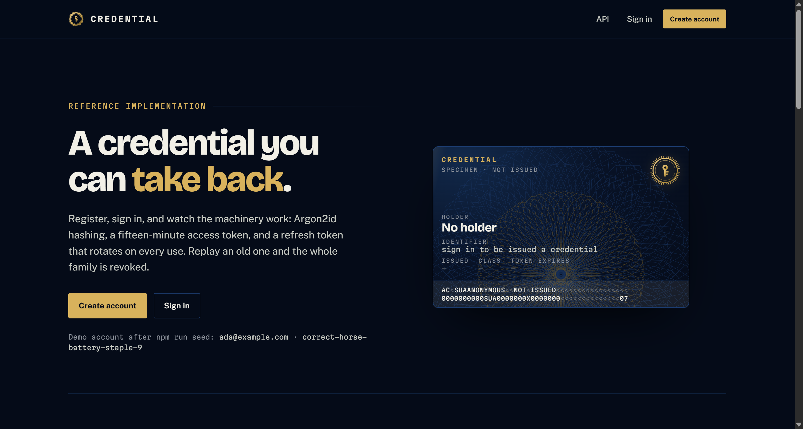
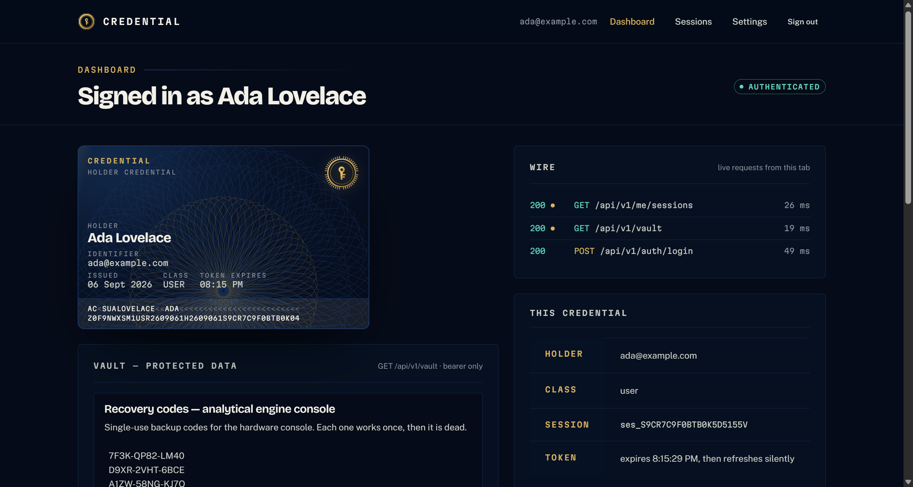
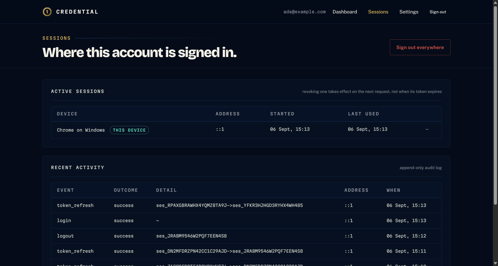
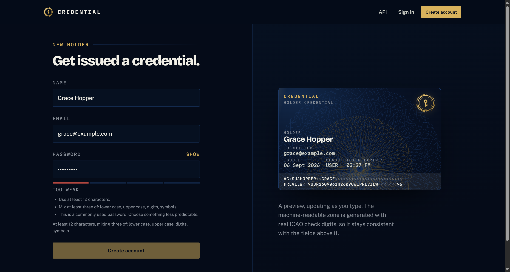

# Secure User Authentication

A working, end-to-end reference implementation of user authentication — not a tutorial stub.
Argon2id password hashing, short-lived JWT access tokens, opaque refresh tokens that rotate on
every use with **reuse detection**, session revocation that cuts off tokens that have not expired
yet, and a protected resource that returns data only to the account that owns it.

Full stack: an Express 5 + TypeScript API over PostgreSQL, and a React 19 + Vite client.
Deployable to Vercel as-is.

<p align="center">
  
</p>

---

## Contents

- [Quick start](#quick-start)
- [Endpoints](#endpoints)
- [Example authenticated request](#example-authenticated-request)
- [Demo](#demo)
- [How the security works](#how-the-security-works)
- [Error codes](#error-codes)
- [Project layout](#project-layout)
- [Testing](#testing)
- [Deploying to Vercel](#deploying-to-vercel)
- [Configuration](#configuration)
- [What is deliberately not here](#what-is-deliberately-not-here)

---

## Quick start

Requires **Node.js 20.11 or newer**. There is no database server to install and nothing to
compile. Locally the API runs [PGlite](https://pglite.dev) — PostgreSQL compiled to WebAssembly
and executed in-process — so `npm install` is the whole setup. Production points the same code at
a managed Postgres by setting `DATABASE_URL`; the SQL is identical either way.

```bash
git clone https://github.com/SNischayPrasad/Secure-User-Authentication.git
cd Secure-User-Authentication
npm install
```

Create the API's environment file and give it a signing key:

```bash
cp server/.env.example server/.env
node -e "const f='server/.env',fs=require('fs');fs.writeFileSync(f,fs.readFileSync(f,'utf8').replace(/^JWT_SECRET=$/m,'JWT_SECRET='+require('crypto').randomBytes(48).toString('base64url')))"
```

> **npm 12 note.** `npm install` may warn that an install script was blocked for `esbuild`.
> That is expected and nothing needs approving — esbuild resolves its binary through optional
> dependencies, so the blocked script has nothing left to do. Tests and builds pass without it.

Seed a demo account, then start both servers:

```bash
npm run seed
npm run dev
```

| | |
|---|---|
| Web client | <http://localhost:5173> |
| API | <http://localhost:4000/api/v1> |
| Health | <http://localhost:4000/api/health> |

**Demo account** — `ada@example.com` / `correct-horse-battery-staple-9`

> The seeded password is a local fixture, published here on purpose so the demo is reproducible.
> It exists only in `server/src/db/seed.ts`. No real credential is committed anywhere in this repo.

---

## Endpoints

Base path `/api/v1`. All requests and responses are JSON. Every response carries an
`X-Request-Id` header, and every error repeats it in the body.

**Auth** column: `—` public · `bearer` needs `Authorization: Bearer <access token>` ·
`cookie` needs the httpOnly `refresh_token` cookie.
Mutating requests other than register and login also need the CSRF header (see
[Example authenticated request](#example-authenticated-request)).

| Method | Path | Auth | Purpose | Success |
|---|---|---|---|---|
| `GET` | `/api/health` | — | Liveness, uptime, version | `200` |
| `GET` | `/api/v1/auth/csrf` | — | Issue the double-submit CSRF token | `200` |
| `POST` | `/api/v1/auth/register` | — | Create an account and sign in | `201` |
| `POST` | `/api/v1/auth/login` | — | Exchange credentials for tokens | `200` |
| `POST` | `/api/v1/auth/refresh` | cookie | Rotate the refresh token, mint a new access token | `200` |
| `POST` | `/api/v1/auth/logout` | cookie | Revoke this session | `204` |
| `POST` | `/api/v1/auth/logout-all` | bearer | Revoke every session for the account | `204` |
| `GET` | `/api/v1/me` | **bearer** | The signed-in account | `200` |
| `PATCH` | `/api/v1/me` | **bearer** | Change the display name | `200` |
| `POST` | `/api/v1/me/password` | **bearer** | Change the password, revoking other sessions | `204` |
| `GET` | `/api/v1/me/sessions` | **bearer** | List active sessions | `200` |
| `DELETE` | `/api/v1/me/sessions/:id` | **bearer** | Revoke one session | `204` |
| `GET` | `/api/v1/me/activity` | **bearer** | Recent authentication events | `200` |
| `GET` | `/api/v1/vault` | **bearer** | Private notes owned by this account | `200` |
| `POST` | `/api/v1/vault` | **bearer** | Add a note | `201` |
| `PATCH` | `/api/v1/vault/:id` | **bearer** | Edit a note | `200` |
| `DELETE` | `/api/v1/vault/:id` | **bearer** | Delete a note | `204` |

`GET /api/v1/me` and `GET /api/v1/vault` are the protected endpoints that return data **only**
when authenticated. Without a valid token they answer `401` and no data at all.

Request and response bodies for every endpoint are in **[docs/api.md](docs/api.md)**.

---

## Example authenticated request

Sign in, keep the access token, and send it as a bearer credential.

```bash
# 1 — sign in and capture the access token
TOKEN=$(curl -s -X POST http://localhost:4000/api/v1/auth/login \
  -H 'Content-Type: application/json' \
  -d '{"email":"ada@example.com","password":"correct-horse-battery-staple-9"}' \
  | node -pe 'JSON.parse(require("fs").readFileSync(0)).accessToken')

# 2 — call the protected route with it
curl -s http://localhost:4000/api/v1/me \
  -H "Authorization: Bearer $TOKEN"
```

```json
{
  "user": {
    "id": "usr_TF2RVVY69QGMRPTTDX0KY",
    "email": "ada@example.com",
    "name": "Ada Lovelace",
    "role": "user",
    "createdAt": 1757150400000,
    "passwordChangedAt": 1757150400000
  }
}
```

The same request without the header returns no data:

```bash
curl -s -i http://localhost:4000/api/v1/me
```

```http
HTTP/1.1 401 Unauthorized
X-Request-Id: req_GNE9FBNBAH9WDTN0S0CV0
Content-Type: application/json

{"error":{"code":"AUTH_REQUIRED","message":"Sign in to continue."},
 "requestId":"req_GNE9FBNBAH9WDTN0S0CV0"}
```

### Mutating requests also need the CSRF header

Anything that relies on the cookie — `refresh`, `logout`, and every write under `/me` and
`/vault` — uses a double-submit token. Fetch it once, then echo the cookie value in the header:

```bash
CSRF=$(curl -s -c jar.txt http://localhost:4000/api/v1/auth/csrf | node -pe 'JSON.parse(require("fs").readFileSync(0)).csrfToken')

curl -s -X POST http://localhost:4000/api/v1/vault \
  -b jar.txt \
  -H "Authorization: Bearer $TOKEN" \
  -H "X-CSRF-Token: $CSRF" \
  -H 'Content-Type: application/json' \
  -d '{"title":"Recovery codes","body":"Single-use backup codes."}'
```

The browser client does all of this automatically in [`web/src/lib/api.ts`](web/src/lib/api.ts).

---

## Demo

### The dashboard — protected data, and the requests that fetched it

<p align="center">
  
</p>

The credential card carries a real ICAO 9303 machine-readable zone: the identifier, role, issue
and expiry dates and session id are encoded with genuine 7-3-1 check digits, so the strip always
agrees with the database. The **Wire** panel is the live request log for the tab — it is the
"example authenticated request" above, happening for real, with status codes and timings.

### Sessions and the audit log

<p align="center">
  
</p>

The `token_refresh` row shows an actual rotation: `ses_6BD745…` was retired and replaced by
`ses_S9TFC3…`.

### Registration, with the policy the server actually enforces

<p align="center">
  
</p>

### Verify it yourself

`scripts/smoke.mjs` exercises the whole surface against a running server and asserts both the
status code and the error code for every case. With the API running:

```bash
node scripts/smoke.mjs
```

```
Service
  PASS  GET  /api/health                                     200                200
...
Refresh rotation and reuse detection
  PASS  POST /auth/refresh   rotate                          200                200
  PASS       token actually changed                          true               true
  PASS  POST /auth/refresh   replay the old token            401                401
  PASS       error code                                      SESSION_REVOKED    SESSION_REVOKED
  PASS  POST /auth/refresh   whole family revoked            401                401
...
All 54 checks passed.
```

The full transcript of a real run is committed at
**[docs/demo-smoke-run.txt](docs/demo-smoke-run.txt)**.

---

## How the security works

| Concern | Decision |
|---|---|
| **Password storage** | Argon2id, `m=19456 KiB, t=2, p=1`, 32-byte output — the OWASP Password Storage minimum — with a per-password salt. The plaintext is never logged, stored, or echoed. |
| **Access token** | JWT HS256, 15 minutes. Issuer, audience and the algorithm allowlist are all verified, so an `alg: none` or `alg: RS256` swap is rejected. |
| **Refresh token** | A 256-bit opaque random value, persisted only as its SHA-256 digest, delivered in an `httpOnly; SameSite=Strict` cookie scoped to `/api/v1/auth`. Script cannot read it, so an XSS payload cannot lift a long-lived credential. |
| **Rotation + reuse detection** | Every refresh mints a successor and retires its predecessor. Presenting a retired token means someone kept a copy, so the **entire token family is revoked** and both the thief and the victim are logged out. |
| **Revocation actually works** | The session behind a token is checked on every authenticated request, so *sign out everywhere* invalidates access tokens immediately instead of waiting 15 minutes for them to expire. Changing a password does the same to every other device. |
| **Account enumeration** | Wrong password and unknown email return byte-identical `401 INVALID_CREDENTIALS` bodies. An unknown email still runs a full Argon2id verification against a dummy hash, so response timing does not leak who has an account either. |
| **Brute force** | Five failed logins lock the account for fifteen minutes and return `423` with `retryAfterSeconds`. Rate limits also apply per IP and per email. |
| **CSRF** | Double-submit cookie. The readable `csrf_token` must be echoed in `X-CSRF-Token`, compared in constant time. A cross-site page can send the cookie but cannot read it to build the header. |
| **Tenant isolation** | Vault items are always scoped by `user_id`. Another account's item id returns `404`, never `403` — a `403` would confirm the id exists. |
| **Transport hardening** | `helmet` with a real CSP, CORS locked to the configured origin, `x-powered-by` disabled, a 32 kB body cap. |
| **Secrets** | The server refuses to boot in production without a `JWT_SECRET` of at least 32 characters. In development it generates an ephemeral one and says so. |
| **Audit** | Every register, login, refresh, rotation, reuse detection, revocation, lockout and password change is written to an append-only `auth_events` table and shown in the UI. |

More detail, including what an attacker gains at each step, is in **[SECURITY.md](SECURITY.md)**.

---

## Error codes

Every failure uses the same envelope:

```json
{ "error": { "code": "VALIDATION_FAILED", "message": "…", "details": [ … ] },
  "requestId": "req_…" }
```

| HTTP | Code | Raised when |
|---|---|---|
| `400` | `VALIDATION_FAILED` | A field is missing or malformed. `details` names each one. |
| `400` | `MALFORMED_JSON` | The request body is not valid JSON. |
| `400` | `WEAK_PASSWORD` | The password fails the policy. `details` lists what to fix. |
| `400` | `SAME_PASSWORD` | The new password equals the current one. |
| `401` | `AUTH_REQUIRED` | No `Authorization: Bearer` header. |
| `401` | `TOKEN_INVALID` | Signature, claims, or algorithm rejected. |
| `401` | `TOKEN_EXPIRED` | The access token is past `exp`. The client refreshes and retries. |
| `401` | `INVALID_CREDENTIALS` | Email or password wrong — deliberately never says which. |
| `401` | `SESSION_INVALID` | The session was revoked or has expired. |
| `401` | `SESSION_REVOKED` | A retired refresh token was replayed; the family was burned. |
| `403` | `CSRF_FAILED` | The CSRF header is missing or does not match the cookie. |
| `404` | `NOT_FOUND` / `ROUTE_NOT_FOUND` | No such resource, or no such route. |
| `409` | `EMAIL_TAKEN` | That email is already registered. |
| `413` | `PAYLOAD_TOO_LARGE` | Body over 32 kB. |
| `423` | `ACCOUNT_LOCKED` | Too many failed logins. `details.retryAfterSeconds` says when to retry. |
| `429` | `RATE_LIMITED` | Rate limit tripped. `Retry-After` is set. |
| `500` | `INTERNAL_ERROR` | Unexpected. Never leaks a stack or an internal message in production. |

---

## Project layout

```
server/
  src/
    app.ts                     Express app factory (middleware order lives here)
    index.ts                   Entry point, graceful shutdown
    config/env.ts              Zod-validated environment
    db/                        Postgres connection (pg / PGlite), schema, migration, seed
    lib/
      password.ts              Argon2id, the password policy, the dummy hash
      tokens.ts                JWT signing and verification, refresh-token minting
      crypto.ts                Ids, random tokens, SHA-256, constant-time compare
      errors.ts                AppError and the named helpers
      audit.ts                 Append-only auth event log
    middleware/
      authenticate.ts          Bearer verification + session and password-age checks
      csrf.ts                  Double-submit enforcement
      rateLimit.ts             Per-IP and per-email limits
      validate.ts              Zod request validation
      errorHandler.ts          The single place errors become responses
    schemas/                   Request shapes
    services/                  User, session and vault data access
    routes/                    auth · me · vault · health
  tests/                       Vitest + supertest integration suite

web/
  src/
    lib/api.ts                 Fetch client: bearer, CSRF, single-flight refresh
    lib/mrz.ts                 ICAO 9303 machine-readable zone encoding
    lib/password.ts            Client mirror of the server policy (server is authoritative)
    state/auth.tsx             Session state; the access token lives only in memory
    components/                Credential card, guilloche, fields, wire panel
    pages/                     Landing · Register · Login · Dashboard · Sessions · Settings
    styles/                    Design tokens and the stylesheet

scripts/smoke.mjs              End-to-end verification against a running server
docs/api.md                    Full request and response reference
```

---

## Testing

```bash
npm test                 # 43 integration tests (vitest + supertest)
node scripts/smoke.mjs   # 54 end-to-end checks against a running server
npm run typecheck        # strict TypeScript, both workspaces
```

The suite runs against the real Express app on an in-memory database and covers registration,
login, validation, protected routes, tenant isolation, CSRF, refresh rotation, refresh **reuse
detection**, revocation, lockout, and the absence of account enumeration. Tests read the stored
row directly to assert that what is persisted is an `$argon2id$` hash and that the plaintext
appears nowhere in it.

---

## Deploying to Vercel

The repository is deployment-ready: `vercel.json` builds the client and exposes the same Express
app as a serverless function at `api/[...path].ts`. A catch-all function file, rather than a
rewrite, is what keeps `req.url` as the real path so Express routes on it unchanged — the code
running in production is the same `createApp()` the test suite drives.

Two things must be set up once, because neither can be inferred.

### 1. A Postgres database

Vercel functions run on a read-only filesystem, so there is nowhere to keep a local database file.
In the Vercel dashboard open the project, then **Storage → Create Database → Neon (Postgres)**.
Vercel injects `DATABASE_URL` into the project automatically; the app picks it up and uses
`node-postgres` instead of PGlite. Nothing else changes — same schema, same SQL.

The schema is applied automatically on the first request after a deploy, so there is no migration
step to run.

### 2. A signing secret

Under **Settings → Environment Variables** add, for all environments:

| Name | Value |
|---|---|
| `JWT_SECRET` | at least 32 characters of randomness |

Generate one with:

```bash
node -e "console.log(require('crypto').randomBytes(48).toString('base64url'))"
```

The server **refuses to boot in production without it** rather than falling back to a default
key, so a missing secret fails loudly at deploy time instead of shipping a forgeable token. If
you see `SERVER_MISCONFIGURED` from the API, this is why.

### 3. Deploy

Import the repository at [vercel.com/new](https://vercel.com/new) and accept the detected
settings — `vercel.json` already specifies the build command, output directory and function
configuration. Every push to `main` then redeploys.

Optionally seed the demo account against the deployed database:

```bash
DATABASE_URL='<the connection string from Neon>' npm run seed
```

### Verifying the deployment

`scripts/smoke.mjs` takes a base URL, so the same 54 checks can be run against the live site:

```bash
SMOKE_BASE=https://your-deployment.vercel.app node scripts/smoke.mjs
```

### What differs in production

- Cookies gain the `Secure` flag, because `NODE_ENV=production`.
- `WEB_ORIGIN` defaults to the deployment URL, so CORS needs no configuration. The client and API
  are same-origin anyway.
- Rate-limit counters live in each warm instance's memory rather than being shared across them.
  Account lockout is unaffected — it is stored in Postgres.

---

## Configuration

`server/.env` — see `server/.env.example`.

| Variable | Default | Notes |
|---|---|---|
| `NODE_ENV` | `development` | `production` enables `Secure` cookies and hides error details |
| `PORT` | `4000` | |
| `WEB_ORIGIN` | `http://localhost:5173` | CORS allowlist |
| `DATABASE_FILE` | `./data/auth-pg` | Where PGlite stores data when `DATABASE_URL` is unset |
| `DATABASE_URL` | — | A Postgres connection string. Set it and the app uses that server instead of PGlite. Vercel injects it automatically when a Neon store is attached. |
| `JWT_SECRET` | — | **Required in production**, minimum 32 characters |
| `JWT_ISSUER` | `secure-user-auth` | Verified on every token |
| `JWT_AUDIENCE` | `secure-user-auth.web` | Verified on every token |
| `ACCESS_TOKEN_TTL` | `900` | Seconds |
| `REFRESH_TOKEN_TTL` | `604800` | Seconds |

In development, leaving `JWT_SECRET` empty generates an ephemeral secret at boot and logs a
warning — tokens then stop working across restarts, which is intentional. In production the
server refuses to start.

---

## What is deliberately not here

Being explicit about scope, because a security README that implies more than it does is worse
than one that says nothing:

- **No email verification or password reset.** Both need an outbound mail provider, which would
  make the project impossible to run from a clone.
- **No multi-factor authentication.** The session and revocation model is built to accommodate it,
  but it is not implemented.
- **No OAuth or social sign-in.**
- **HTTPS is assumed to terminate upstream.** `Secure` cookies and `trust proxy` are set for
  production, but the app itself serves plain HTTP.
- **No connection pooler in front of Postgres.** Fine at this scale, and Neon's pooled
  connection string handles it; a busy deployment would want PgBouncer.

---

## License

MIT — see [LICENSE](LICENSE).
